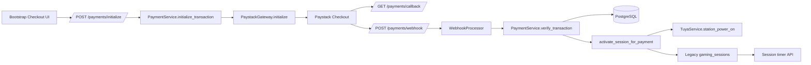

# Payment Module Architecture

## Overview

The Paystack module is implemented with Flask Blueprint + service-layer orchestration and webhook-first payment finalization.

## Components

- app/payment/routes.py: HTTP surface, auth checks, CSRF checks, rate limits.
- app/payment/services.py: business logic, Paystack calls, verification, activation.
- app/payment/webhook.py: signature validation, replay guard, webhook event processing.
- app/models/payment.py: payment and audit log entities.
- app/models/session.py: payment user/station/session entities.

## Design Principles

- Route handlers remain thin.
- Domain logic is isolated in PaymentService.
- Webhook drives final activation.
- Existing session control APIs are reused for countdown/timer lifecycle.
