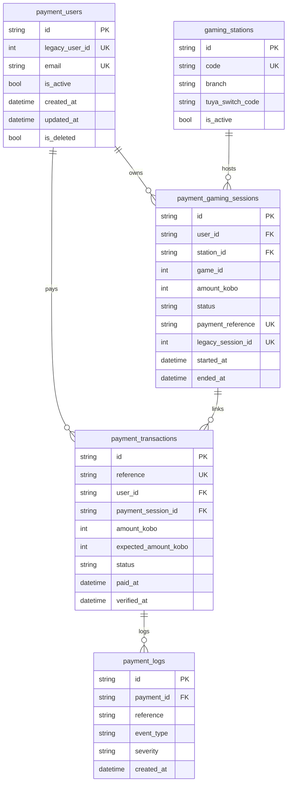

# Payment ERD

```mermaid
erDiagram
  payment_users ||--o{ payment_gaming_sessions : owns
  payment_users ||--o{ payment_transactions : pays
  gaming_stations ||--o{ payment_gaming_sessions : hosts
  payment_gaming_sessions ||--o{ payment_transactions : links
  payment_transactions ||--o{ payment_logs : logs

  payment_users {
    string id PK
    int legacy_user_id UK
    string email UK
    bool is_active
    datetime created_at
    datetime updated_at
    bool is_deleted
  }

  gaming_stations {
    string id PK
    string code UK
    string branch
    string tuya_switch_code
    bool is_active
  }

  payment_gaming_sessions {
    string id PK
    string user_id FK
    string station_id FK
    int game_id
    int amount_kobo
    string status
    string payment_reference UK
    int legacy_session_id UK
    datetime started_at
    datetime ended_at
  }

  payment_transactions {
    string id PK
    string reference UK
    string user_id FK
    string payment_session_id FK
    int amount_kobo
    int expected_amount_kobo
    string status
    datetime paid_at
    datetime verified_at
  }

  payment_logs {
    string id PK
    string payment_id FK
    string reference
    string event_type
    string severity
    datetime created_at
  }
```
