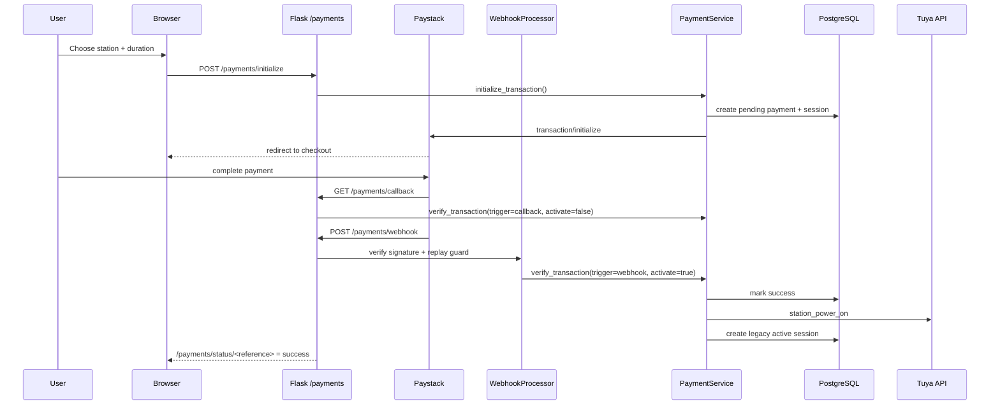

# Payment Sequence Diagram

```mermaid
sequenceDiagram
  participant U as User
  participant UI as Browser
  participant API as Flask /payments
  participant PAY as Paystack
  participant WH as WebhookProcessor
  participant SVC as PaymentService
  participant DB as PostgreSQL
  participant TY as Tuya API

  U->>UI: Choose station + duration
  UI->>API: POST /payments/initialize
  API->>SVC: initialize_transaction()
  SVC->>DB: create pending payment + session
  SVC->>PAY: transaction/initialize
  PAY-->>UI: redirect to checkout
  U->>PAY: complete payment
  PAY->>API: GET /payments/callback
  API->>SVC: verify_transaction(trigger=callback, activate=false)
  PAY->>API: POST /payments/webhook
  API->>WH: verify signature + replay guard
  WH->>SVC: verify_transaction(trigger=webhook, activate=true)
  SVC->>DB: mark success
  SVC->>TY: station_power_on
  SVC->>DB: create legacy active session
  API-->>UI: /payments/status/<reference> = success
```
